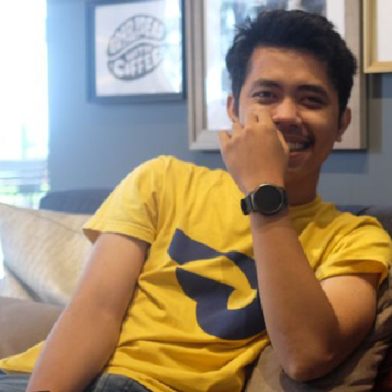

<html lang="en">
<head>
    <meta charset="UTF-8">
    <meta name="viewport" content="width=device-width, initial-scale=1.0">
    <title>Modern CV - Andi Irfan Maulana</title>
    <link href="https://fonts.googleapis.com/css2?family=Montserrat:wght@400;700&display=swap&family=Roboto:wght@300;400&display=swap" rel="stylesheet">
    
</head>
<body>
    <header>
        <h1>Andi Irfan Maulana</h1>
        
Web Developer & Professional Event Organizer

        <!-- Background Music -->
        <audio autoplay loop muted>
            <source src="musik.mp3" type="audio/mp3">
            Your browser does not support the audio element.
        </audio>
    </header>

    <nav>
        <a href="#about">About</a>
        <a href="#skills">Skills</a>
        <a href="#experience">Experience</a>
        <a href="#contact">Contact</a>
    </nav>

    

        <section id="about" class="about">
            
            

                <h2>About Me</h2>
                
I am a passionate web developer with over 5 years of experience in creating dynamic and responsive websites...

            

        </section>

        <section id="skills" class="skills">
            

                <h3>Web Development</h3>
                
Expertise in HTML, CSS, JavaScript.

            

            

                <h3>Design</h3>
                
CorelDraw, Adobe Photoshop, Illustrator.

            

            

                <h3>Microsoft</h3>
                
Excel, Word, PowerPoint.

            

        </section>

        <section id="experience" class="experience">
            <h2 class="section-title">Experience</h2>
            

                <h3>Team Leader PT. Yasika Production</h3>
                
Mengelola dan memimpin tim, memberikan bimbingan, menyelesaikan masalah di lapangan, mengevaluasi kerja tim.

            

            

                <h3>Project Officer PT. Color Production</h3>
                
Koordinasi antar pemangku kepentingan, membuat perencanaan dan pengawasan, mengembangkan strategi mitigasi dan manajemen risiko.

            

            

                <h3>Area Sales Manager PT. MultiBintang Tbk.</h3>
                
Koordinasi antar pemangku kepentingan, membuat perencanaan dan pengawasan, mengembangkan strategi mitigasi dan manajemen risiko.

            

            

                <h3>Head Of Team PT. Ghaisan Utama Indomedia</h3>
                
Koordinasi antar pemangku kepentingan, membuat perencanaan dan pengawasan, mengembangkan strategi mitigasi dan manajemen risiko.

            

            

                <h3>Web Development</h3>
                
Memimpin proyek desain dari konsep hingga penyelesaian, dengan fokus pada penciptaan antarmuka yang intuitif dan menarik secara visual...

            

        </section>

        <section id="contact" class="contact">
            <h2 class="section-title">Hubungi Saya</h2>
            

                
                
                
            

        </section>
    

    <footer>
        
&copy; 2024 Andi Irfan Maulana. All rights reserved.

    </footer>
</body>
</html>
